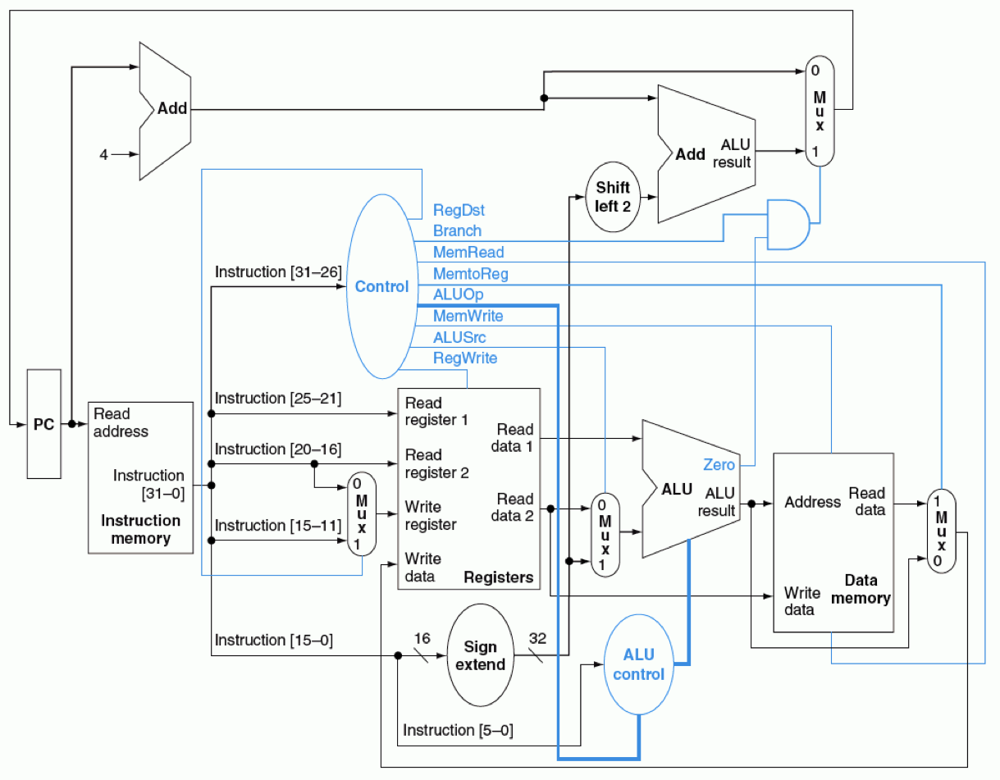
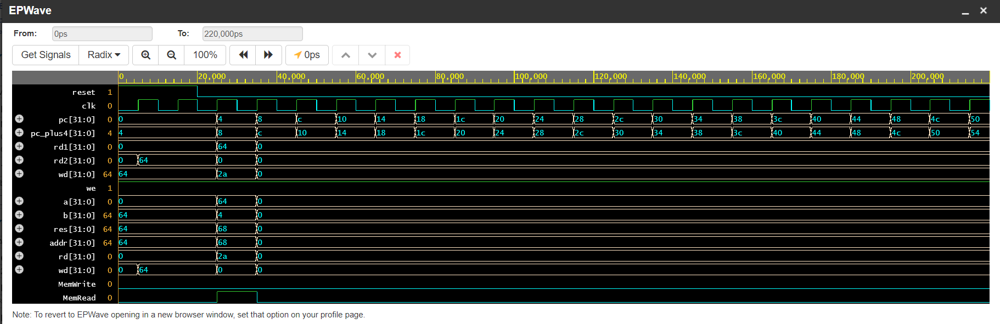

# Single-Cycle 32-bit MIPS Processor in VHDL

This project is a complete RTL implementation of a **32-bit single-cycle MIPS processor**
designed in **VHDL**.  
The processor follows the classic MIPS single-cycle datapath and is intended for
educational and academic purposes, especially for **Computer Architecture / x86-related courses**.

---

## 📌 Project Overview

This project implements a **single-cycle MIPS CPU**, where each instruction is executed
in exactly **one clock cycle**.  
All main components of a MIPS processor are modeled at RTL level, including the datapath,
control unit, register file, ALU, and memory modules.

The design was simulated using **EDA Playground** with **Riviera-PRO**, and verified through
waveform analysis.

---

## 🧠 Processor Architecture

The processor follows the classic single-cycle MIPS datapath architecture:

**Main components:**
- Program Counter (PC)
- Instruction Memory
- Register File (32 × 32-bit)
- ALU
- Data Memory
- Control Unit
- ALU Control
- Multiplexers and adders

---

## 🧾 Supported Instructions

The processor supports the following MIPS instructions:

### R-Type Instructions
- `add`
- `sub`
- `and`
- `or`
- `slt`

### Memory Instructions
- `lw` (Load Word)
- `sw` (Store Word)

### Branch Instructions
- `beq` (Branch if Equal)

---

## 🔧 Datapath Description

The datapath connects all functional units required for instruction execution.
Key operations include:

- PC update (`PC + 4`)
- Instruction fetch from instruction memory
- Register read and write operations
- ALU execution (arithmetic, logic, address calculation)
- Memory access for `lw` and `sw`
- Result selection using multiplexers

Since the processor is **single-cycle**, all operations are completed in one clock period.

---

## 🎛️ Control Unit

The control unit decodes the opcode field of the instruction and generates the required
control signals for the datapath.

### Control Signals
- `RegDst`
- `ALUSrc`
- `MemRead`
- `MemWrite`
- `MemtoReg`
- `RegWrite`
- `Branch`
- `ALUOp`

The `ALU_Control` module further decodes `ALUOp` and instruction function fields
to generate the final ALU control signals.

---
## 📁 Project Structure
├── ALU.vhd # Arithmetic Logic Unit
├── Reg_File.vhd # Register file (32 registers, 32-bit)
├── Control_Unit.vhd # Main control unit
├── ALU_Control.vhd # ALU control logic
├── Instr_Mem.vhd # Instruction memory
├── Data_Mem.vhd # Data memory
├── PC.vhd # Program counter
├── Datapath.vhd # CPU datapath
├── Cpu_TopLevel.vhd # Top-level CPU module
├── testbench.vhd # Testbench
└── README.md

---

## 🧪 Simulation & Verification

The processor was verified through simulation using **EDA Playground** and **EPWave**.

### Observed Signals
- `clk`, `reset`
- `PC`, `PC + 4`
- Register read/write data
- ALU inputs and result
- Memory address and data
- `RegWrite`, `MemRead`, `MemWrite`

### Example Waveform

The waveforms confirm correct instruction execution, PC update, register write-back,
and memory access behavior.

---

## ▶️ How to Run the Simulation

1. Open **EDA Playground**
2. Select:
   - Language: **VHDL**
   - Simulator: **Riviera-PRO**
3. Upload all `.vhd` files
4. Run the simulation
5. Open **EPWave** to inspect signals

---

## ⚠️ Limitations

- Single-cycle architecture (no pipelining)
- No hazard detection
- No forwarding unit
- No cache memory
- Instruction memory initialized manually

---

## 🚀 Future Improvements

- Multi-cycle MIPS implementation
- Pipelined MIPS processor
- Hazard detection unit
- Forwarding unit
- Instruction and data cache
- Support for more MIPS instructions

---

## 👤 Author

- **Project Type:** Academic / Educational
- **Course:** Computer Architecture / Microprocessors
- **HDL:** VHDL

---

## 📜 License

This project is intended for educational use.

## 📁 Project Structure

